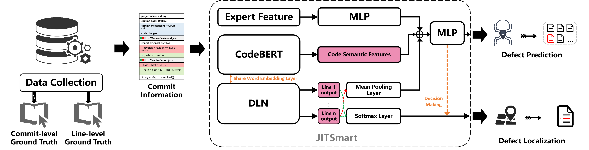

# JIT-Smart Replication Package


This repository contains the source code and the guidelines for reproducing the paper "JIT-Smart: A Co-Learning Framework for Just-In-Time Defect Prediction and Localization"


The reproduction steps are as follows:

## 🚀Dataset
 Our experiments are based on the large-scale commit-level and line-level dataset [JIT-Defect4J](https://github.com/jacknichao/JIT-Fine), which contains 21 software java projects.


## 🚀 Overview
In this paper, we propose JIT-Smart - a deep learning based and unified JIT-DP and JIT-DL model that can both identify defect-introducing commits (i.e. at commit-level) and locate which code line introduce the defect in the commit (i.e. at line-level). More specifically, the main difference between us compared to previous JIT-DP and JIT-DL research is that we design a novel defect localization network (DLN) specifically for the JIT-DL task, which explicitly introduces the label information of the defective code line for supervised learning. We treat JIT-DP and JIT-DL tasks as a multi-task co-learning process.



## 🚀 Environment Setup


Run the following command under your python environment

```shell
pip install requirements.txt
```


## 🚀 Experiment Result Replication Steps

Note: To minimize the threats to internal validity, we use the source code provided in the corresponding research instead of implementing the compared baselines ourselves. We set the default optimal parameters and operating methods from the corresponding papers to ensure the accuracy of our reproduction. And some evaluation results of the studied baselines are cited from [Ni et al.](https://github.com/jacknichao/JIT-Fine)

### ⭐ RQ1: How effective is JIT-Smart in just-in-time defect prediction task?

Step 1: Run the following two (*.ipynb) files to convert the line-level data annotation format.
  ```shell
./JITSmart/process and label defect code lines/extract defect lines.ipynb

./JITSmart/process and label defect code lines/label defect lines.ipynb
  ```
Step 2: Train and evaluate our JIT-Smart and JIT-Fine in the JIT-DP task.
  ```shell
sh train_jitsmart.sh
sh train_jitfine.sh
  ```


### ⭐ RQ2: How well can JIT-Smart locate defective lines in just-in-time defect localization task?


Step 1: Train and evaluate our JIT-Smart and JIT-Fine in the JIT-DL task.
  ```shell
sh train_jitsmart.sh
sh train_jitfine.sh
  ```


### ⭐ RQ3: What is the accuracy of JIT-Smart compared to the state-of-the-art baseline under the cross-project experimental setting?


Step 1: Generate the cross-project data for JIT-Fine and our JIT-Smart.
  ```shell
python jitsmart cross prj data generate.py
python jitfine cross prj data generate.py
  ```


Step 2: Train and evaluate our JIT-Smart and JIT-Fine in the JIT-DP and JIT-DL tasks under cross-project settings.

  ```shell
sh train_jitsmart_cross_prj.sh
sh train_jitfine_cross_prj.sh
  ```

### ⭐ RQ4: How do the different loss function weight assignments affect the performance of JIT-Smart?


  ```shell
sh train_jitsmart_loss_weight.sh
  ```


# Some attempts:
We have previously attempted to solve DP and DL tasks with a single network. The results also reflect from the side that JIT-Smart learns jointly through DP and DL network multi-tasks, and the granularity of the captured feature information is also different. Joint modeling and joint optimization is conducive to mutual promotion of their performance. It can also be confirmed from the experimental results that JIT-Smart outperforms the existing optimal methods.

**Attempt 1:** The following is the test result of our modeling using only CodeBERT (the same as the input form of DLN in JIT-Smart, a two-dimensional matrix). In this modeling method, token-level modeling is performed on the first six layers of BERT, and line-level modeling is performed on the last six layers. The results show that this structure also outperforms previous methods on all metrics, but far worse than JIT-Smart on DL tasks. The reason why this design performs worse than JIT-Smart is that it is difficult to use commit-level learning (commit-level semantic features, expert features and commit-level labels) to guide line-level prediction results so that reducing false positives.
  
**Commit-level:**
- F1 = 0.456
- AUC = 0.887
- Recall@20%Effort = 0.813
- Effort@20%Recall = 0.012
- Popt = 0.943  

**Line-level:**
- Top-5-ACC = 0.231
- Top-10-ACC = 0.235
- Recall@20%Effort_line = 0.259
- Effort@20%Recall_line = 0.294
- IFA = 96.618

**Attempt 2:** The following is the test result of our modeling using only DLN (the same as the input form of DLN in JIT-Smart, a two-dimensional matrix). The results show that the structure is far worse than JIT-Smart in all metrics. The reason why this design performs worse than JIT-Smart is also that it is difficult to use commit-level learning (commit-level semantic features, expert features and commit-level labels) to guide line-level prediction results so that reducing false positives.

**Commit-level:**  
- F1 = 0.36
- AUC = 0.853
- Recall@20%Effort = 0.782
- Effort@20%Recall = 0.512
- Popt = 0.935  

**Line-level:**  
- Top-5-ACC = 0.43
- Top-10-ACC = 0.29
- Recall@20%Effort_line = 0.605
- Effort@20%Recall_line = 0.29
- IFA = 0.405

